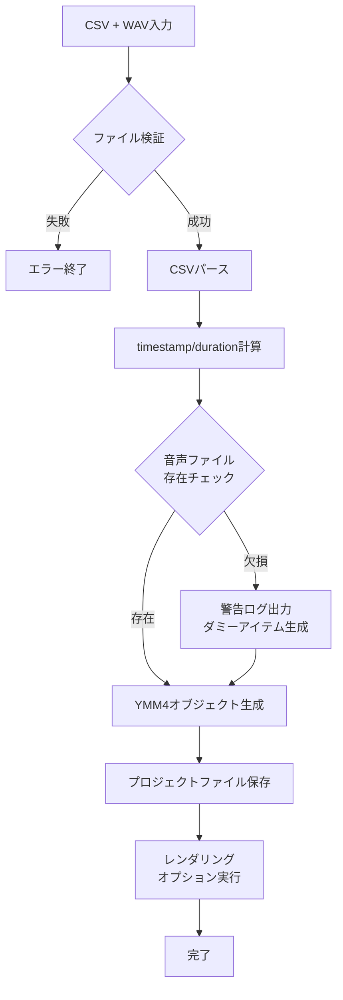

# YMM4 エクスポート仕様書（プラグインAPI版）

**Version**: 1.0  
**Status**: 仕様策定完了（TASK_009）  
**Created**: 2026-02-03  
**Target**: TASK_007 プラグイン実装の前提仕様  

---

## 1. 概要

### 1.1 目的

本仕様書は、CSVタイムラインからYMM4（ゆっくりムービーメーカー4）へのエクスポート仕様を定義します。
**YMM4プラグインAPI（.NET 9）** を優先したアプローチを採用し、TASK_007（プラグイン実装）の具体的な設計指針を提供します。

### 1.2 対象範囲

- CSVタイムラインとYMM4オブジェクトのデータマッピング
- YMM4プラグインAPI（IVoicePlugin, ITimelineItem等）の利用方針
- プロジェクトファイル（.ymmp）生成仕様
- エラーハンドリングと検証ルール

### 1.3 非対象

- YMM4本体の機能変更・拡張
- AutoHotkeyによるGUI自動化（代替手段として別途検討）
- 既存CSV生成フローの破壊的変更

---

## 2. CSV ↔ YMM4 データマッピング仕様

### 2.1 入力データ構造（CSV + WAV）

#### CSVフォーマット

```csv
speaker,text
timestamp,duration,audio_path,text
```

| CSV列 | 必須 | 内容 | YMM4対応オブジェクト |
|-------|------|------|---------------------|
| speaker | ○ | 話者名 | VoiceSynthesisItem.Voice または キャラクター設定 |
| text | ○ | テロップテキスト | TextItem.TextContent |
| timestamp | - | 開始時刻（秒） | TimelineItem.Start |
| duration | - | 表示時間（秒） | TimelineItem.Duration |
| audio_path | - | 音声ファイルパス | VoiceSynthesisItem または AudioFileItem |

#### 音声ファイル命名規則

| パターン | 例 | 用途 |
|----------|-----|------|
| `{行番号}.wav` | `001.wav`, `002.wav` | CSV行番号（1-based）との対応 |
| `{行番号}.mp3` | `001.mp3`, `002.mp3` | 代替フォーマット |

### 2.2 YMM4オブジェクトへのマッピング

#### レイヤー構成

```
YMM4タイムライン
├── Layer 0: 音声レイヤー（VoiceSynthesisItem / AudioFileItem）
├── Layer 1: 字幕レイヤー（TextItem - ふきだし）
├── Layer 2: 装飾レイヤー（ImageFileItem / FigureItem）
└── Layer 3+: ユーザー編集用予約
```

#### 詳細マッピング表

| CSVデータ | YMM4プロパティ | データ型 | 変換ルール |
|-----------|---------------|----------|-----------|
| `speaker` | `VoiceSynthesisItem.Voice` | string | 話者名をYMM4ボイスIDにマッピング（後述の対応表参照） |
| `text` | `TextItem.TextContent` | string | そのまま設定 |
| `text` | `VoiceSynthesisItem.Text` | string | 音声合成時に使用 |
| `timestamp` | `TimelineItem.Start` | TimeSpan | `TimeSpan.FromSeconds(timestamp)` |
| `duration` | `TimelineItem.Duration` | TimeSpan | `TimeSpan.FromSeconds(duration)` |
| `audio_path` | `AudioFileItem.FilePath` | string | 絶対パスまたはプロジェクト相対パス |

#### 話者名→YMM4ボイス対応表（デフォルト）

| CSV話者名 | YMM4 Voice ID | 備考 |
|-----------|--------------|------|
| `ずんだもん` | `Zundamon` | 四国めたん音声ライブラリ |
| `四国めたん` | `ShikokuMetan` | 四国めたん音声ライブラリ |
| `ナレーター` | `Yukari` | 結月ゆかり（デフォルト） |
| `Speaker1` | `Yukari` | デフォルトボイス |
| その他 | `Yukari` | マッピング未定時のフォールバック |

**注**: カスタムマッピングはプラグイン設定で上書き可能

### 2.3 タイムスタンプ計算

#### 基本計算式

```csharp
// CSV行 → YMM4タイムライン配置
Start = BaseTime + timestamp
End = Start + duration
Duration = end_time - start_time
```

#### 重複タイムスタンプの扱い

| 状況 | 処理方針 |
|------|----------|
| 同一タイムスタンプ | 警告ログ出力、後続行を+0.1秒ずつシフト |
| 時間重複 | 許容（YMM4は重複アイテムをサポート） |
| 負のタイムスタンプ | エラー、0秒にクリップして警告 |

---

## 3. YMM4プラグインAPI仕様

### 3.1 使用API一覧

| APIインターフェース | 用途 | 実装優先度 |
|--------------------|------|-----------|
| `IPlugin` | プラグイン基本機能 | 必須 |
| `IVoicePlugin` | 音声合成連携 | 高 |
| `ITextItem` | 字幕テキスト配置 | 高 |
| `ITimelineItem` | タイムライン項目操作 | 高 |
| `IFileImportPlugin` | 外部ファイルインポート | 中 |
| `ISettingPlugin` | 設定UI提供 | 中 |

### 3.2 IVoicePlugin実装仕様

```csharp
// YMM4 API準拠のインターフェース実装
[Export(typeof(IVoicePlugin))]
public class CsvTimelineVoicePlugin : IVoicePlugin
{
    // === 基本プロパティ ===
    public string Name => "CSV Timeline Voice";
    public string Id => "nlmslide.csv-voice";
    public string Description => "CSVタイムラインから音声アイテムを生成";
    
    // === 対応ボイスタイプ ===
    public IEnumerable<VoiceType> SupportedVoiceTypes => new[]
    {
        VoiceType.Yukari,
        VoiceType.Zundamon,
        VoiceType.ShikokuMetan,
        VoiceType.ExternalFile // 外部WAVファイル使用
    };
    
    // === 音声生成メソッド ===
    public async Task<VoiceResult> CreateVoiceAsync(
        string text,
        VoiceSettings settings,
        CancellationToken cancellationToken = default)
    {
        // 1. settingsからCSV行情報を復元
        // 2. 既存WAVファイルパスを取得
        // 3. AudioFileItemを生成・配置
        // 4. VoiceResultを返却
    }
    
    // === CSV連携メソッド（拡張）===
    public async Task<IEnumerable<AudioItem>> ImportFromCsvAsync(
        string csvPath,
        string audioDir,
        CancellationToken cancellationToken = default)
    {
        // CSVとWAVを読み込み、AudioItemリストを生成
    }
}
```

#### VoiceSettings拡張パラメータ

```csharp
public class CsvVoiceSettings : VoiceSettings
{
    // 基本パラメータ（YMM4標準）
    public string Text { get; set; }
    public VoiceType Voice { get; set; }
    public float Speed { get; set; } = 1.0f;
    public float Volume { get; set; } = 1.0f;
    
    // CSV連携拡張パラメータ
    public string CsvRowId { get; set; }      // CSV行識別子
    public string AudioFilePath { get; set; } // 外部WAVパス
    public float StartTime { get; set; }      // 開始時刻（秒）
    public float Duration { get; set; }       // 継続時間（秒）
    public string SpeakerName { get; set; }   // 話者名
}
```

### 3.3 ITimelineItem実装仕様

#### タイムライン配置フロー

```csharp
public async Task PlaceTimelineItemsAsync(
    IProject project,
    CsvTimelineData csvData,
    CancellationToken ct = default)
{
    foreach (var row in csvData.Rows)
    {
        // 1. 音声アイテム作成
        var voiceItem = project.Timeline.CreateVoiceItem();
        voiceItem.Text = row.Text;
        voiceItem.Voice = MapSpeakerToVoice(row.Speaker);
        voiceItem.Start = TimeSpan.FromSeconds(row.Timestamp);
        voiceItem.Duration = TimeSpan.FromSeconds(row.Duration);
        
        // 2. 外部WAVが指定されていれば設定
        if (!string.IsNullOrEmpty(row.AudioPath))
        {
            voiceItem.UseExternalAudio = true;
            voiceItem.ExternalAudioPath = row.AudioPath;
        }
        
        // 3. 字幕アイテム作成（オプション）
        var textItem = project.Timeline.CreateTextItem();
        textItem.TextContent = row.Text;
        textItem.Start = voiceItem.Start;
        textItem.Duration = voiceItem.Duration;
        textItem.Layer = 1; // 字幕レイヤー
        
        // 4. ふきだしスタイル適用
        textItem.Style = GetSpeechBubbleStyle(row.Speaker);
    }
}
```

#### レイヤー配置ルール

| レイヤー番号 | 用途 | Z-Order |
|-------------|------|---------|
| 0 | 音声（Voice/Audio） | 最背面 |
| 1 | 字幕テキスト | 中間 |
| 2 | 装飾・背景 | 前面 |
| 3+ | ユーザー編集用 | 最前面 |

### 3.4 ファイルパス扱い

#### パス解決優先順位

```
1. 絶対パス（存在確認）
2. プロジェクト相対パス（.ymmpからの相対）
3. CSV相対パス（CSVファイルからの相対）
4. プラグイン設定のデフォルトパス
```

#### パス変換例

| 入力 | 出力 | 条件 |
|------|------|------|
| `C:\audio\001.wav` | そのまま使用 | 絶対パス |
| `001.wav` | `{ProjectDir}\audio\001.wav` | プロジェクト相対 |
| `..\audio\001.wav` | 解決済み絶対パス | 親ディレクトリ参照 |

---

## 4. エクスポートフロー

### 4.1 全体フロー図



### 4.2 APIコール順序

```csharp
// エクスポート実行シーケンス
public async Task ExportToYmm4Async(ExportRequest request)
{
    // 1. プラグイン初期化
    var plugin = await InitializePluginAsync();
    
    // 2. YMM4プロジェクト作成/読み込み
    var project = await CreateOrLoadProjectAsync(request.TemplatePath);
    
    // 3. CSVデータ読み込み・検証
    var csvData = await ParseCsvAsync(request.CsvPath);
    ValidateCsvData(csvData);
    
    // 4. タイムスタンプ計算
    CalculateTimestamps(csvData);
    
    // 5. 音声ファイルマッピング
    await MapAudioFilesAsync(csvData, request.AudioDir);
    
    // 6. タイムラインアイテム生成
    await PlaceTimelineItemsAsync(project, csvData);
    
    // 7. プロジェクト保存
    await project.SaveAsync(request.OutputPath);
    
    // 8. 完了レポート生成
    GenerateExportReport(csvData, request.OutputPath);
}
```

### 4.3 プロジェクトファイル構造

#### 出力ディレクトリ構成

```
ymm4_export_{timestamp}/
├── project.ymmp                    # YMM4プロジェクトファイル
├── timeline_plan.json              # タイムライン計画情報
├── slides_payload.json             # スライド情報（TASK_009準拠）
├── export_metadata.json            # エクスポートメタデータ
├── logs/
│   └── export_YYYYMMDD_HHMMSS.log  # 詳細ログ
├── audio/                          # コピーされた音声ファイル
│   ├── 001.wav
│   ├── 002.wav
│   └── ...
└── csv/
    └── source.csv                  # 元CSVコピー
```

#### export_metadata.jsonスキーマ

```json
{
  "export_version": "1.0",
  "export_timestamp": "2026-02-03T14:30:00Z",
  "source": {
    "csv_path": "/path/to/timeline.csv",
    "audio_dir": "/path/to/audio",
    "total_rows": 50,
    "valid_rows": 48,
    "skipped_rows": 2
  },
  "output": {
    "project_file": "/path/to/project.ymmp",
    "item_count": 48,
    "total_duration": 300.5
  },
  "mapping": {
    "voice_mappings": {
      "ずんだもん": "Zundamon",
      "四国めたん": "ShikokuMetan"
    }
  },
  "warnings": [
    {
      "row": 25,
      "message": "音声ファイルが見つかりません: 025.wav"
    }
  ]
}
```

---

## 5. エラーハンドリング方針

### 5.1 エラーカテゴリ

| コード | カテゴリ | 説明 | 動作 |
|--------|----------|------|------|
| E001 | ファイルアクセス | CSV/音声ファイルが存在しない | エラー終了 |
| E002 | パースエラー | CSVフォーマット不正 | エラー終了 |
| E003 | データ検証 | 必須列欠損、型不正 | 該当行スキップ、警告 |
| E004 | 音声欠損 | 指定音声ファイルが存在しない | ダミーアイテム生成、警告 |
| E005 | YMM4連携 | プラグインAPI呼び出し失敗 | リトライ3回、失敗時エラー |
| E006 | タイムスタンプ | 負の値、重複、不連続 | 自動補正、警告 |

### 5.2 長尺テキスト分割対応

CSV仕様（`spec_csv_input_format.md`）に準拠した自動分割をサポート:

```csharp
public List<TimelineItem> SplitLongText(CsvRow row, int maxChars = 60)
{
    if (row.Text.Length <= maxChars)
        return CreateSingleItem(row);
    
    // 句読点で分割
    var segments = TextSplitter.SplitByPunctuation(row.Text, maxChars);
    
    // 分割後の時間配分
    var totalDuration = row.Duration;
    var durationPerChar = totalDuration / row.Text.Length;
    
    var items = new List<TimelineItem>();
    float currentTime = row.Timestamp;
    
    foreach (var segment in segments)
    {
        var segmentDuration = segment.Length * durationPerChar;
        items.Add(new TimelineItem
        {
            Text = segment,
            Start = currentTime,
            Duration = segmentDuration,
            IsContinued = items.Count > 0
        });
        currentTime += segmentDuration;
    }
    
    return items;
}
```

### 5.3 リトライ戦略

| 操作 | リトライ回数 | インターバル | バックオフ |
|------|-------------|-------------|-----------|
| ファイル読み込み | 3 | 1秒 | 固定 |
| YMM4 API呼び出し | 3 | 2秒 | 指数バックオフ |
| プロジェクト保存 | 2 | 1秒 | 固定 |

---

## 6. TASK_007実装ガイド

### 6.1 実装ステップ

```
Step 1: プラグイン基本実装（IPlugin）
  └─ YMM4プラグイン一覧への表示確認

Step 2: IVoicePlugin実装
  └─ 音声アイテム生成・配置

Step 3: CSVインポート機能実装
  └─ ファイルダイアログ、ドラッグ&ドロップ対応

Step 4: 字幕連動機能実装
  └─ TextItem自動生成・スタイル適用

Step 5: 検証・テスト
  └─ エラーハンドリング、エッジケース対応
```

### 6.2 実装ファイル構成

```
ymm4-plugin/
├── VoicePlugin/
│   ├── CsvTimelineVoicePlugin.cs    # IVoicePlugin実装（本仕様準拠）
│   ├── CsvImporter.cs               # CSVパース・検証
│   └── AudioFileMapper.cs           # 音声ファイルマッピング
├── TextPlugin/
│   └── CsvSubtitlePlugin.cs         # 字幕配置（オプション）
├── Core/
│   ├── CsvParser.cs                 # CSVパース共通処理
│   ├── TimelineCalculator.cs        # タイムスタンプ計算
│   └── ExportReporter.cs            # レポート生成
└── Settings/
    └── VoiceMappingSettings.cs      # 話者マッピング設定
```

### 6.3 インターフェース詳細仕様

#### ICsvVoicePlugin（カスタム拡張）

```csharp
/// <summary>
/// CSVタイムライン連携専用ボイスプラグインインターフェース
/// </summary>
public interface ICsvVoicePlugin : IVoicePlugin
{
    /// <summary>
    /// CSVファイルから一括インポート
    /// </summary>
    Task<ImportResult> ImportFromCsvAsync(
        string csvPath,
        ImportOptions options,
        CancellationToken ct = default);
    
    /// <summary>
    /// 話者名→Voiceマッピング設定
    /// </summary>
    void ConfigureVoiceMapping(Dictionary<string, string> mapping);
    
    /// <summary>
    /// インポート結果レポート生成
    /// </summary>
    ExportReport GenerateReport(ImportResult result);
}

public class ImportOptions
{
    public string AudioDirectory { get; set; }
    public string ProjectTemplate { get; set; }
    public bool AutoPlaceSubtitles { get; set; } = true;
    public bool SkipMissingAudio { get; set; } = false;
    public int MaxCharsPerSlide { get; set; } = 60;
}

public class ImportResult
{
    public bool Success { get; set; }
    public int TotalRows { get; set; }
    public int ImportedRows { get; set; }
    public int SkippedRows { get; set; }
    public List<ImportWarning> Warnings { get; set; }
    public string OutputProjectPath { get; set; }
}
```

---

## 7. 検証・テスト仕様

### 7.1 必須テストケース

| ID | テスト内容 | 期待結果 |
|----|-----------|----------|
| T001 | 正常系CSVインポート | 全行がタイムラインに配置される |
| T002 | 音声ファイル欠損 | 警告出力、処理継続、ダミーアイテム生成 |
| T003 | 長尺テキスト分割 | 60文字境界で分割、時間配分正確 |
| T004 | タイムスタンプ重複 | +0.1秒シフト、警告出力 |
| T005 | 話者名カスタムマッピング | 設定通りにVoiceが選択される |
| T006 | 大容量CSV（1000行） | 処理時間<30秒、メモリ安定 |
| T007 | 無効CSVフォーマット | エラーメッセージ明確、終了コード非0 |

### 7.2 テストデータサンプル

```csv
# test_basic.csv - 基本ケース
ずんだもん,こんにちは
四国めたん,こんにちは、今日もよろしくお願いします
ずんだもん,では始めましょう

# test_long_text.csv - 長尺分割ケース
Speaker1,これは非常に長いテロップで、句読点で区切られています。複数のスライドに分割される必要があります。

# test_missing_audio.csv - 音声欠損ケース
Speaker1,音声あり（001.wav対応）
Speaker2,音声なし（002.wav欠損）
```

---

## 8. 関連ドキュメント

- `docs/spec_csv_input_format.md` - CSV入力フォーマット詳細
- `docs/ymm4_integration_arch.md` - YMM4連携全体アーキテクチャ
- `docs/ymm4_export_spec.md` - YMM4エクスポート機能仕様（旧版）
- `docs/tasks/TASK_007_YMM4PluginIntegration.md` - プラグイン実装タスク
- https://ymm-api-docs.vercel.app/ - YMM4 API公式ドキュメント

---

## 9. 変更履歴

| 日付 | バージョン | 内容 | 担当 |
|------|-----------|------|------|
| 2026-02-03 | 1.0 | 初版作成（TASK_009完了） | AI |

---

## 10. 承認

- [ ] 技術レビュー完了
- [ ] TASK_007実装者確認
- [ ] ドキュメント統合承認
