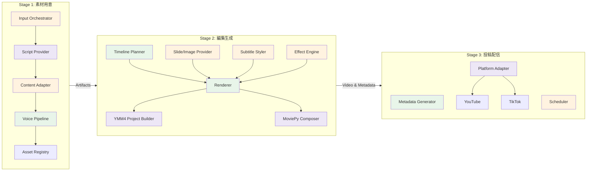
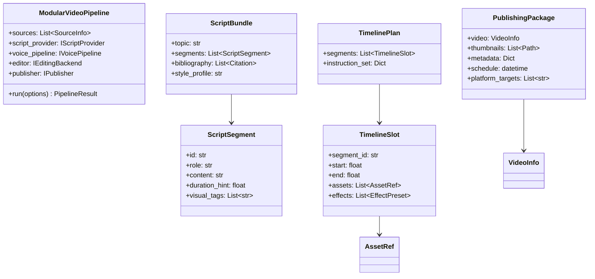
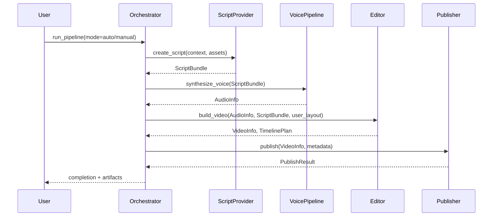

# NLMandSlideVideoGenerator システムアーキテクチャ

## 概要

NLMandSlideVideoGeneratorは、台本生成から動画投稿までを段階的に自動化しつつ、工程単位で手動・半自動・全自動を切り替えられるモジュラー型ワークフロー基盤です。NotebookLM/Gemini、手動アップロード、MCP ブラウザ操作、YukkuriMovieMaker4 (YMM4) API など複数の実装モードを同一パイプラインで統合します。

## システム構成図

### Stage 1: 素材用意レイヤー
- **Input Orchestrator**: NotebookLM/外部MCP/手動アップロードなど複数入力経路を抽象化。
- **Script Provider**: NotebookLM/Gemini、自前プロンプト実行、CSV/PDF手動投入を `IScriptProvider` で差し替え。
- **Content Adapter**: NotebookLM固有フォーマット（DeepDive等）を一般化し、台本セクション・メタ情報・引用元を抽出して内部スキーマへ変換。
- **Voice Pipeline**: `TTSIntegration` に基づく合成音声/手動収録音声を切替、品質検証とフォーマット統一を担当。`src/core/voice_pipelines/tts_voice_pipeline.py` に実装された `TTSVoicePipeline` が `IVoicePipeline` を満たし、`PIPELINE_COMPONENTS.voice_pipeline` が `tts` または `gemini_tts` の場合に `build_default_pipeline()` で注入される。
- **Asset Registry**: `data/` 配下への素材登録、再利用用メタデータ管理、差分検知を実装予定。

### Stage 2: 編集生成レイヤー
- **Timeline Planner**: 台本セグメントとユーザー編集方針をマッピングし、所要時間やスライド割当を決定。`src/core/timeline/basic_planner.py` の `BasicTimelinePlanner` がデフォルト実装として提供され、音声長と台本セグメントをもとにタイムラインを算出する。
- **Slide/Image Provider**: NotebookLMスライド、手動画像、Google Slides API生成、YMM4テンプレート差し替えを統合。
- **Subtitle Styler**: `SubtitleGenerator` を拡張し、装飾テーマをプロフィール化（影・縁取り・アニメーション設定）。
- **Effect Engine**: `EffectProcessor` をベースに、パン/ズーム、モーションプリセット、YMM4専用エフェクトタグを付与。
- **Renderer**:
  - **YMM4 Project Builder**: YMM4 API (https://ymm-api-docs.vercel.app/) を利用し、テンプレート`.exo`や`.y4mmp`を複製。タイムライン、立ち絵、字幕パーツをAPI経由で挿入。
  - **MoviePy Composer**: 既存 `VideoComposer` を使用する `MoviePyEditingBackend` が `src/core/editing/moviepy_backend.py` に実装され、`PIPELINE_COMPONENTS.editing_backend=moviepy` の場合に利用される。
  - **YMM4 Project Builder**: `src/core/editing/ymm4_backend.py` が `.y4mmp` テンプレート複製と AutoHotkey フォールバックを行い、`PIPELINE_COMPONENTS.editing_backend=ymm4` で注入される。現状は MoviePy にフォールバックして動画書き出しを行い、YMM4 プロジェクトファイルと補助情報を出力する。
  - **運用メモ**: 現状のYMM4 APIでは書き出し機能が未提供の可能性があるため、AutoHotkey等によるGUI自動操作を併用するフォールバック手段を用意する。テンプレート/スクリプトの指定は `config/settings.py` の `YMM4_SETTINGS` で管理する。

### Stage 3: 投稿配信レイヤー
- **Metadata Generator**: `MetadataGenerator` を再構築し、台本・トピック・引用元から概要欄/タグ/広告挿入ポイントを生成。テンプレートはユーザー編集を反映可能なJSON化。
- **Scheduler**: 予約投稿、公開設定、広告位置、ショート/ロングフォーマットの自動判定を担う抽象化。
- **Platform Adapter**: `YouTubeUploader` を中心に、将来的な TikTok/Shorts API、外部クリエイターツールと接続するプラガブル設計。

## ドメインモデル概要

### 主要インターフェイス
- `IScriptProvider`: NotebookLM、Gemini、手動CSVなどから `ScriptBundle` を生成。
- `IVoicePipeline`: TTS/収録音源を共通 `AudioInfo` 形式へ正規化。
- `IEditingBackend`: MoviePy・YMM4などレンダリング基盤を差し替え。
- `IPublisher`: YouTube/TikTok/ローカル出力等をモジュラー接続。

## フロー詳細

### フォールバックと拡張ポイント
- **台本工程**: NotebookLMが利用不可の場合、Gemini + Web MCP、またはユーザーがNotebookLMから抽出したJSON/Markdownをアップロード。
- **音声**: ElevenLabs/OpenAI/AzureのTTS、またはユーザー提供音声を `AudioValidator` が品質チェック後に採用。
- **編集**: ユーザーがYMM4テンプレートを調整すれば、テンプレート差分のみAPI適用。テンプレート未整備時はMoviePyを使用。
- **投稿**: YouTubeへの自動投稿、またはメタデータ/サムネイルのみ作成して手動投稿に切替可能。

## アーキテクチャの特徴

### 1. **段階的自動化とモード切替**
- 各Stageで `mode=manual|assist|auto` を設定可能。ユーザー操作とAI自動化を共存させ、段階別に最適化。

### 2. **疎結合モジュール**
- Protocol/Interfaceベースで結合度を下げ、API差し替えや機能追加を容易化。
- `src/core/pipeline.py` の `ModularVideoPipeline` を拡張し、各Stageのインターフェイスを注入。

### 3. **YMM4連携の拡張点**
- テンプレート `.y4mmp` をベースに、シーン・オブジェクト・字幕をAPIで追加。
- 生成後にYMM4を起動すれば、ユーザーはGUIで微調整可能。
- YMM4が利用できない環境では `MoviePyEditingBackend` をフォールバックとして利用し、`run_modular_demo.py` などからモード切替で動作確認できる。

### 4. **マルチプラットフォーム投稿**
- YouTube以外にTikTok/Shortsを視野に入れ、動画縦横比や長さ、広告挿入ポイントを自動計算して出力。
- 投稿前にヒューマンレビューを挟む「承認キュー」設計を想定。

### 5. **監査性と再現性**
- `Asset Registry` が素材出典とライセンス情報を保持。
- 台本 -> 映像 -> 投稿までのトレーサビリティをJSONログで記録。

## 実装ロードマップ概要
- Stage 1: Script Provider抽象化、NotebookLMフォーマットの正規化、手動アップロードUI/CLIの整備。**実装済み**: `GeminiScriptProvider` と `TTSVoicePipeline` を `build_default_pipeline()` から設定で切替可能。
- Stage 2: YMM4 APIクライアント実装、テンプレート同期ツール、字幕装飾プリセット。**進捗**: `BasicTimelinePlanner` / `MoviePyEditingBackend` / `YMM4EditingBackend` をモジュラー構成に追加し、設定 `EDITING_BACKEND` で切替可能。
- Stage 3: メタデータテンプレート化、予約投稿/広告挿入API連携、サムネイル自動生成。

これらのモジュールを順次拡張することで、ユーザーがAI自動編集と手動細部調整を柔軟に切り替えられるYouTube/TikTok向け動画制作基盤を実現します。

## モジュラーパイプライン設定とテスト手順

- **設定ファイル**: `config/settings.py` の `PIPELINE_COMPONENTS` により、`script_provider` / `voice_pipeline` / `editing_backend` / `platform_adapter` を切り替えられる。`build_default_pipeline()` (`src/core/pipeline.py`) が設定値を読み取り、該当するモジュールを注入する。
- **Stage1デフォルト**: `SCRIPT_PROVIDER=gemini` かつ `GEMINI_API_KEY` が設定されている場合、`GeminiScriptProvider` が `IScriptProvider` として利用される。`VOICE_PIPELINE` を `tts` または `gemini_tts` にすると `TTSVoicePipeline` が有効になる。
- **Stage2デフォルト**: `EDITING_BACKEND=moviepy` で `BasicTimelinePlanner` と `MoviePyEditingBackend` が有効化される。`EDITING_BACKEND=ymm4` にすると `YMM4EditingBackend` が選択され、MoviePy によるフォールバック出力と並行して YMM4 プロジェクトが生成される。
- **テスト**:
  - 単体テストは `python -m pytest tests\test_timeline_planner.py` で実行でき、`BasicTimelinePlanner` のタイムライン整合性を検証する。
  - 追加の統合スモークテストとして `run_modular_demo.py` を利用し、`PIPELINE_COMPONENTS` で指定した構成が `ModularVideoPipeline` (`src/core/pipeline.py`) に反映されることを確認する。
