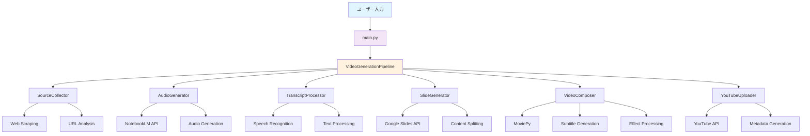
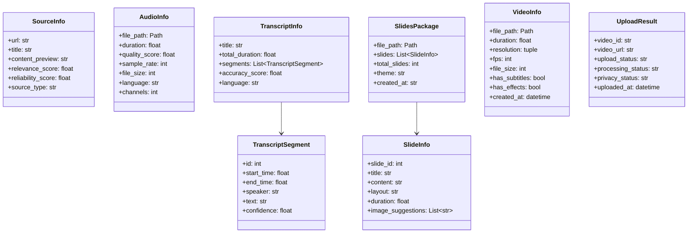
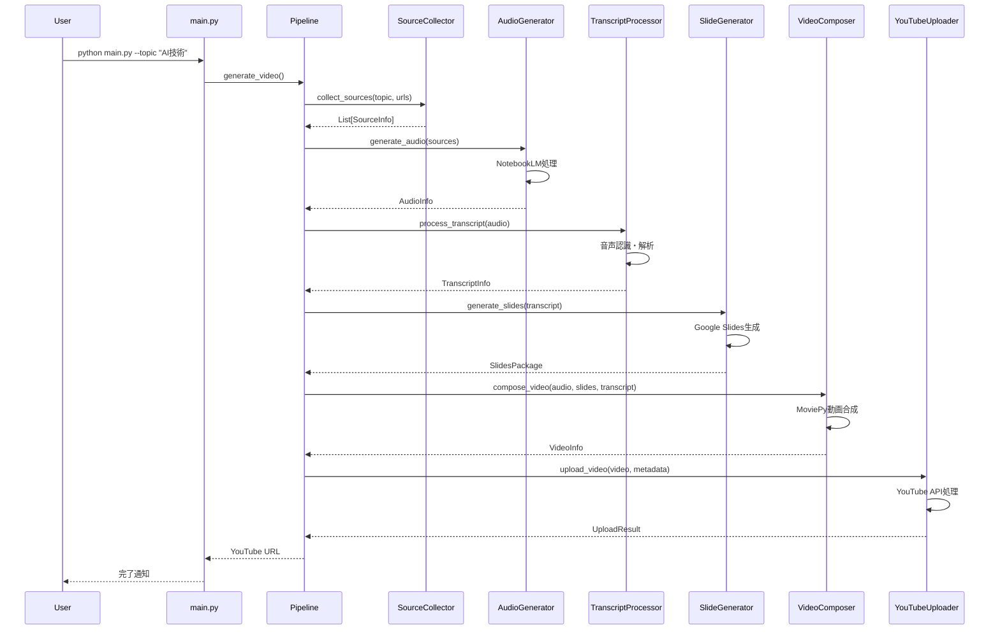

# NLMandSlideVideoGenerator システムアーキテクチャ

## 概要

NLMandSlideVideoGeneratorは、NotebookLMとGoogle Slidesを活用してYouTube解説動画を自動生成するシステムです。

## システム構成図

## クラス図

```mermaid
classDiagram
    class VideoGenerationPipeline {
        +source_collector: SourceCollector
        +audio_generator: AudioGenerator
        +transcript_processor: TranscriptProcessor
        +slide_generator: SlideGenerator
        +video_composer: VideoComposer
        +youtube_uploader: YouTubeUploader
        +generate_video(topic, urls, options) str
    }
    
    class SourceCollector {
        +collect_sources(topic, urls) List~SourceInfo~
        -_process_url(url, topic) SourceInfo
        -_search_sources(topic, count) List~SourceInfo~
    }
    
    class AudioGenerator {
        +generate_audio(sources, topic) AudioInfo
        -_create_notebook_session() str
        -_upload_sources(session_id, sources) bool
        -_generate_audio_content(session_id) AudioInfo
    }
    
    class TranscriptProcessor {
        +process_transcript(audio_info) TranscriptInfo
        -_transcribe_audio(audio_file) List~TranscriptSegment~
        -_analyze_segments(segments) TranscriptInfo
    }
    
    class SlideGenerator {
        +generate_slides(transcript, max_slides) SlidesPackage
        -_generate_slides_with_google(contents, title) SlidesPackage
        -_create_new_presentation(session_id, title) str
    }
    
    class VideoComposer {
        +compose_video(audio, slides, transcript, quality) VideoInfo
        -_extract_slide_images(slides_file) List~Path~
        -_compose_final_video(audio, images, subtitles, quality) VideoInfo
    }
    
    class YouTubeUploader {
        +upload_video(video_info, metadata, private) UploadResult
        -_authenticate_youtube() object
        -_upload_video_file(video_path, metadata) UploadResult
    }
    
    VideoGenerationPipeline --> SourceCollector
    VideoGenerationPipeline --> AudioGenerator
    VideoGenerationPipeline --> TranscriptProcessor
    VideoGenerationPipeline --> SlideGenerator
    VideoGenerationPipeline --> VideoComposer
    VideoGenerationPipeline --> YouTubeUploader
```

## データクラス図

## シーケンス図

## UML図の読み方

### クラス図の記号説明

- **クラス名**: 各ボックスの上部に表示
- **属性**: `+` は public、`-` は private
- **メソッド**: `()` 付きで表示、戻り値の型も記載
- **関連**: 矢印で依存関係を表現
- **データ型**: `List~Type~` は List[Type] を意味

### シーケンス図の読み方

- **縦軸**: 時間の流れ（上から下）
- **横軸**: システムコンポーネント
- **実線矢印**: 同期呼び出し
- **破線矢印**: 戻り値
- **アクティベーション**: 縦の長方形は処理実行中を表す

## アーキテクチャの特徴

### 1. **モジュラー設計**
- 各機能が独立したクラスとして実装
- 単一責任原則に基づく設計
- テストとメンテナンスが容易

### 2. **非同期処理**
- `async/await` を使用した効率的な処理
- I/O待機時間の最適化
- 複数API呼び出しの並列処理

### 3. **エラーハンドリング**
- 各段階での適切な例外処理
- ログ出力による問題追跡
- フォールバック機能の実装

### 4. **設定管理**
- 環境変数ベースの設定
- API キーの安全な管理
- 実行環境別の設定切り替え

### 5. **拡張性**
- 新しいソース収集方法の追加が容易
- 異なる動画品質・形式への対応
- プラグイン的な機能追加が可能
