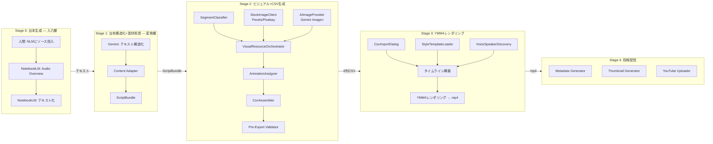
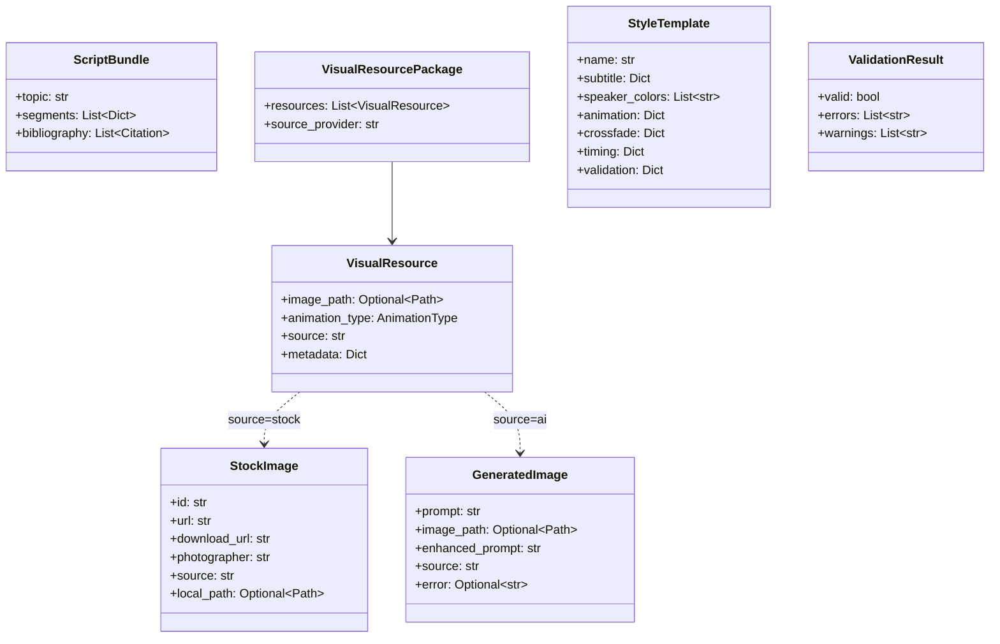
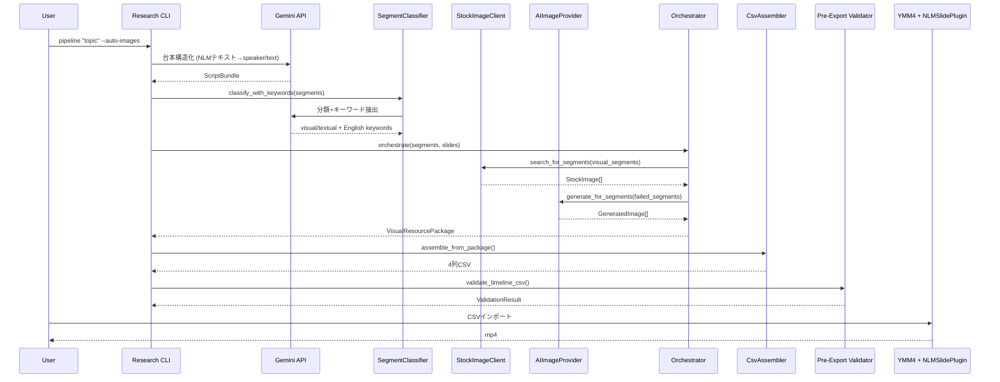

# NLMandSlideVideoGenerator システムアーキテクチャ

最終更新: 2026-03-22

## 概要

NLMandSlideVideoGeneratorは、NotebookLMの台本品質を活かした動画制作を段階的に自動化するモジュラー型ワークフロー基盤です。

> **根本ワークフロー** (DESIGN_FOUNDATIONS.md Section 0):
> NLM ソース投入 → Audio Overview → テキスト化 → Gemini構造化 → CSV組立 → YMM4レンダリング

NotebookLM が台本品質を決定し、Python (CLI/Web UI) が台本構造化・ビジュアルリソース取得・CSV生成を行い、YukkuriMovieMaker4 (YMM4) + NLMSlidePlugin で音声合成・タイムライン構築・最終レンダリングを行います。

## システム構成図


```mermaid
flowchart LR
    subgraph S0[Stage 0: 台本生成 — 入力層]
        Z1[人間: NLMにソース投入] --> Z2[NotebookLM: Audio Overview]
        Z2 --> Z3[NotebookLM: テキスト化]
    end

    subgraph S1[Stage 1: 台本構造化+素材用意 — 変換層]
        A1[Gemini: テキスト構造化] --> A3[Content Adapter]
        A3 --> A4[ScriptBundle]
    end

    subgraph S2[Stage 2: ビジュアル+CSV生成]
        B1[SegmentClassifier]
        B2[StockImageClient<br/>Pexels/Pixabay]
        B3[AIImageProvider<br/>Gemini Imagen]
        B4[VisualResourceOrchestrator]
        B5[AnimationAssigner]
        B6[CsvAssembler]
        B7[Pre-Export Validator]
        B1 --> B4
        B2 --> B4
        B3 --> B4
        B4 --> B5
        B5 --> B6
        B6 --> B7
    end

    subgraph S3[Stage 3: YMM4レンダリング]
        C1[CsvImportDialog]
        C2[StyleTemplateLoader]
        C3[VoiceSpeakerDiscovery]
        C4[タイムライン構築]
        C5[YMM4レンダリング → mp4]
        C1 --> C4
        C2 --> C4
        C3 --> C4
        C4 --> C5
    end

    subgraph S4[Stage 4: 投稿配信]
        D1[Metadata Generator]
        D2[Thumbnail Generator]
        D3[YouTube Uploader]
    end

    S0 -->|テキスト| S1 -->|ScriptBundle| S2 -->|4列CSV| S3 -->|mp4| S4
```

### Stage 0: 台本生成 — 入力層 (NotebookLM + 人間)

> 根本ワークフロー (DESIGN_FOUNDATIONS.md Section 0)

1. 人間が NotebookLM にソース (URL/テキスト/PDF) を投入
2. NotebookLM が Audio Overview (ポッドキャスト形式の対話音声) を生成
3. 音声を NotebookLM に再投入し、テキスト化 (文字起こし)

台本品質は NotebookLM が決定する。この工程は現在 Web UI で手動実行。

### Stage 1: 台本構造化+素材用意レイヤー (Python + Gemini)

- **Gemini 構造化** (`src/notebook_lm/gemini_integration.py`): NotebookLM テキストを Gemini API で構造化 (speaker/text 分離)。台本を「生成」するのではなく「構造化」する。NLM テキスト未提供時のみフォールバックとして台本を生成 (品質劣化を前提)。
- **Gemini Script Provider** (`src/core/providers/script/gemini_provider.py`): `IScriptProvider` インターフェース。根本フローでは構造化用途。フォールバック時のみ生成用途。
- **NotebookLM Provider** (`src/core/providers/script/notebook_lm_provider.py`): NotebookLM テキスト入力の受付。`IScriptProvider` 実装。
- **Content Adapter** (`src/core/adapters/`): NotebookLM固有フォーマット（DeepDive等）を `ScriptBundle` に正規化。
- **音声**: YMM4内蔵ゆっくりボイスを使用。Python側は音声生成を行わない。

### Stage 2: ビジュアルリソース+CSV生成レイヤー (Python)

- **SegmentClassifier** (`src/core/visual/segment_classifier.py`): 台本セグメントをvisual/textualに分類。ヒューリスティック + Gemini分類の2モード。
- **StockImageClient** (`src/core/visual/stock_image_client.py`): Pexels/Pixabay APIで写真検索・ダウンロード。日本語→英語クエリ翻訳 (Gemini)、指数バックオフリトライ。
- **AIImageProvider** (`src/core/visual/ai_image_provider.py`): Gemini Imagen 4 でカスタムイラスト生成。stock画像取得失敗時のフォールバック。
- **TextSlideGenerator** (`src/core/visual/text_slide_generator.py`): テキスト主体セグメント用のスライドPNG自動生成。Pillow描画、テーマ切替、日本語フォント自動検出、ハッシュベースキャッシュ。
- **VisualResourceOrchestrator** (`src/core/visual/resource_orchestrator.py`): 全ビジュアルリソースを統合。stock→AI→slideのフォールバック連鎖、連続source多様性強制、アニメーション自動割当。
- **AnimationAssigner** (`src/core/visual/animation_assigner.py`): ken_burns/zoom_in/zoom_out/pan_left/pan_right/pan_up/pan_down/static の8種を自動サイクル割当。
- **CsvAssembler** (`src/core/csv_assembler.py`): 台本 + VisualResourcePackage → 4列CSV (speaker, text, image_path, animation_type)。
- **Pre-Export Validator** (`src/core/editing/pre_export_validator.py`): CSVバリデーション (画像存在、アニメーション種別、行数チェック)。
- **StyleTemplateManager** (`src/core/style_template.py`): `config/style_template.json` の読み込み・検証・複数テンプレート管理。
- **PipelineState** (`src/core/pipeline_state.py`): パイプラインステップの永続化と再開 (SP-034)。

### Stage 3: YMM4レンダリングレイヤー (C# NLMSlidePlugin)

- **CsvImportDialog**: CSVインポートUI。AudioItem (音声) + TextItem (字幕) + ImageItem (背景画像) を自動配置。
- **StyleTemplateLoader** (`ymm4-plugin/Core/StyleTemplateLoader.cs`): `style_template.json` をPythonと共有読み込み。字幕スタイル/アニメーション設定/クロスフェード/タイミングを統一。
- **VoiceSpeakerDiscovery**: YMM4内蔵ボイスの自動検出・話者割当。
- **WavDurationReader**: WAV実尺読み取り → VoiceItem.VoiceLength でタイムライン同期。
- **ValidateImportItems**: インポート前の品質チェック (連続同一画像検出、統計サマリー)。

### Stage 4: 投稿配信レイヤー (Python)

- **Metadata Generator**: 台本・トピック・引用元から概要欄/タグ/チャプターを生成。
- **Thumbnail Generator**: テンプレートベースのサムネイル自動生成。
- **YouTube Uploader**: YouTube Data API による投稿。手動投稿へのフォールバックも可能。

## ドメインモデル概要


```mermaid
classDiagram
    class ScriptBundle {
        +topic: str
        +segments: List~Dict~
        +bibliography: List~Citation~
    }

    class VisualResourcePackage {
        +resources: List~VisualResource~
        +source_provider: str
    }

    class VisualResource {
        +image_path: Optional~Path~
        +animation_type: AnimationType
        +source: str
        +metadata: Dict
    }

    class StockImage {
        +id: str
        +url: str
        +download_url: str
        +photographer: str
        +source: str
        +local_path: Optional~Path~
    }

    class GeneratedImage {
        +prompt: str
        +image_path: Optional~Path~
        +enhanced_prompt: str
        +source: str
        +error: Optional~str~
    }

    class StyleTemplate {
        +name: str
        +subtitle: Dict
        +speaker_colors: List~str~
        +animation: Dict
        +crossfade: Dict
        +timing: Dict
        +validation: Dict
    }

    class ValidationResult {
        +valid: bool
        +errors: List~str~
        +warnings: List~str~
    }

    VisualResourcePackage --> VisualResource
    VisualResource ..> StockImage : source=stock
    VisualResource ..> GeneratedImage : source=ai
```

## フロー詳細


```mermaid
sequenceDiagram
    participant User
    participant CLI as Research CLI
    participant Gemini as Gemini API
    participant Classifier as SegmentClassifier
    participant Stock as StockImageClient
    participant AI as AIImageProvider
    participant Orch as Orchestrator
    participant Asm as CsvAssembler
    participant Val as Pre-Export Validator
    participant YMM4 as YMM4 + NLMSlidePlugin

    User->>CLI: pipeline "topic" --auto-images
    CLI->>Gemini: 台本構造化 (NLMテキスト→speaker/text)
    Gemini-->>CLI: ScriptBundle
    CLI->>Classifier: classify_with_keywords(segments)
    Classifier->>Gemini: 分類+キーワード抽出
    Gemini-->>Classifier: visual/textual + English keywords
    CLI->>Orch: orchestrate(segments, slides)
    Orch->>Stock: search_for_segments(visual_segments)
    Stock-->>Orch: StockImage[]
    Orch->>AI: generate_for_segments(failed_segments)
    AI-->>Orch: GeneratedImage[]
    Orch-->>CLI: VisualResourcePackage
    CLI->>Asm: assemble_from_package()
    Asm-->>CLI: 4列CSV
    CLI->>Val: validate_timeline_csv()
    Val-->>CLI: ValidationResult
    User->>YMM4: CSVインポート
    YMM4-->>User: mp4
```

### フォールバック連鎖

1. **ビジュアルリソース**: Pexels → Pixabay → Gemini Imagen → TextSlideGenerator → 空欄
2. **台本**: NotebookLM Audio Overview+テキスト化 (正規) → Gemini台本生成 (フォールバック) → 手動CSV
3. **Geminiモデル**: gemini-2.5-flash → gemini-2.0-flash → モック
4. **分類**: Gemini分類 → ヒューリスティック分類
5. **投稿**: YouTube自動投稿 → メタデータのみ生成 → 手動投稿

## アーキテクチャの特徴

### 1. Python/C# 二層構成

- NotebookLM: 台本品質の源泉 (Audio Overview → テキスト化)
- Python: 変換層 (台本構造化→ビジュアル→CSV) + 品質検証
- C# (NLMSlidePlugin): YMM4内でCSV→タイムライン→音声→レンダリング
- 両者は `config/style_template.json` を共有し、スタイル設定を統一

### 2. ビジュアルリソースの多段フォールバック

- SegmentClassifier がセグメントの性質を判定 (visual vs textual)
- visual: StockImageClient (Pexels→Pixabay) → AIImageProvider (Gemini Imagen) → スライド
- textual: スライド (STATIC アニメーション)
- 連続source多様性制御 (MAX_CONSECUTIVE_STOCK=3)

### 3. 統一スタイルテンプレート

- `config/style_template.json` が字幕/アニメーション/クロスフェード/タイミング/話者色を定義
- Python `StyleTemplateManager` と C# `StyleTemplateLoader` の両方が同一JSONを読み込み
- C#側の全ハードコード値をテンプレート参照に置換済み

### 4. CLI一気通貫 + 段階実行

- `research_cli.py pipeline` で collect→script→align→review→CSV一括実行
- 各ステップは独立実行可能 (段階デバッグ)
- PipelineState による途中再開 (SP-034)

### 5. Gemini統合 (5用途)

- 台本構造化 / フォールバック台本生成 (Gemini Flash)
- セグメント分類 + 英語キーワード抽出 (Gemini Flash)
- 日本語→英語クエリ翻訳 (Gemini Flash)
- AI画像生成 (Imagen 4)
- 台本補完 (CsvScriptCompletionPlugin, Gemini Flash)

## 支援サブシステム

### NotebookLM統合 (`src/notebook_lm/`)

NotebookLMテキストの受入・構造化を担う変換レイヤー。(ディレクトリ名は歴史的遺産。src/notebook_lm/README.md 参照)

- **SourceCollector**: Web情報収集 + 信頼度スコアリング (Brave Search廃止済み。根本ワークフローではソース投入は人間がNotebookLMに直接行う。レガシーコード)
- **GeminiIntegration**: Gemini APIによる台本構造化 (NLMテキスト→speaker/text分離)。NLMテキスト未提供時のみフォールバック台本生成。モデルチェーン: gemini-2.5-flash → gemini-2.0-flash → モック
- **TranscriptProcessor**: 音声文字起こし結果の構造化 (SRT変換、キーポイント抽出、精度算出)
- **ScriptAlignment**: 台本と素材の整合チェック
- **CsvTranscriptLoader**: CSV形式の台本読み込み
- **AudioGenerator**: レガシースタブ。音声合成はYMM4の責務。Python側は音声生成を行わない
- **ResearchModels**: 調査データのデータクラス群

### スライド・Google Slides (`src/slides/`)

- **ContentSplitter**: トランスクリプトセグメントをスライド単位に分割 (トピック変化検出、話者変化判定、時間ギャップ検出)
- **SlideGenerator**: スライドパッケージ生成
- **GoogleSlidesClient**: Google Slides APIによるプレゼンテーション作成 (オプション)

### YouTube投稿 (`src/youtube/`)

- **MetadataGenerator**: 台本・トピック・引用元から概要欄・タグ・チャプター・ハッシュタグ・SEO最適化を自動生成
- **YouTubeUploader**: YouTube Data APIによる動画投稿・手動投稿フォールバック

### サムネイル生成 (`src/core/thumbnails/`)

- **TemplateThumbnailGenerator**: テンプレートベースのサムネイル自動生成 (Pillow描画)
- **AIThumbnailGenerator**: AI画像を活用したサムネイル生成

### 運用API (`src/server/`)

- **OperationalAPIServer**: FastAPIベースの運用ダッシュボード (オプション)
  - ヘルスチェック、Prometheusメトリクス (オプション)
  - パイプラインジョブ管理、クリーンアップタスク

### ユーティリティ (`src/core/utils/`)

- **SimpleLogger**: 統一ログ出力 (Unicode安全)
- **FFmpegUtils**: FFmpeg検出・バージョン確認・コーデック情報取得
- **ToolDetection**: 外部実行ファイル (YMM4, FFmpeg等) の自動検出
- **Decorators**: リトライデコレータ (`retry_on_failure`)

### コア基盤 (`src/core/`)

- **Pipeline** (`pipeline.py`): メインパイプライン構築・実行
- **StageRunners** (`stage_runners.py`): 各ステージの実行ロジック
- **Exceptions** (`exceptions.py`): ドメイン固有例外階層 (`PipelineError` → `StageError` / `ConfigError` 等)
- **Interfaces** (`interfaces.py`): Protocol定義 (`IScriptProvider`, `IThumbnailGenerator` 等)
- **Models** (`models.py`): `PipelineArtifacts` 等の共通データモデル
- **Helpers** (`helpers.py`): `with_fallback`, `build_default_pipeline` 等のユーティリティ

### Web UI (`src/web/`)

- **Streamlit Web App** (`web_app.py`): メインWeb UI
- **Pages** (`ui/pages/`): home, pipeline, research, settings, asset_management, material_pipeline, tests, documentation
- **Logic** (`logic/`): PipelineManager, TestManager

## 設定と環境

### 環境変数

```bash
GEMINI_API_KEY=...      # 台本構造化/分類/翻訳/AI画像生成
PEXELS_API_KEY=...      # ストック画像検索
PIXABAY_API_KEY=...     # ストック画像検索 (フォールバック)
```

### 設定ファイル

| ファイル | 用途 |
| --- | --- |
| `config/settings.py` | パイプライン設定、APIキー、パス管理 |
| `config/style_template.json` | スタイルテンプレート (Python/C#共有) |
| `config/style_template_cinematic.json` | シネマティックテンプレート (バリアント) |
| `config/style_template_minimal.json` | ミニマルテンプレート (バリアント) |

### 主要ライブラリ

```python
# AI/API
google-genai             # Gemini SDK (台本構造化/分類/翻訳/画像生成)
requests                 # Pexels/Pixabay API

# 画像・音声
Pillow                   # サムネイル・テキストスライド生成
pydub                    # 音声処理

# Web UI / Server
streamlit                # Web UI
fastapi + uvicorn        # 運用API (オプション)

# テスト
pytest                   # 1262テストPASS (2026-03-18時点)
```

### ディレクトリ構成

```
src/
├── main.py                          # エントリポイント
├── core/
│   ├── pipeline.py                  # メインパイプライン
│   ├── pipeline_state.py            # PipelineState (再開機能)
│   ├── csv_assembler.py             # CsvAssembler
│   ├── style_template.py            # StyleTemplateManager
│   ├── stage_runners.py             # ステージ実行ロジック
│   ├── exceptions.py                # ドメイン固有例外階層
│   ├── interfaces.py                # Protocol定義
│   ├── models.py                    # PipelineArtifacts等
│   ├── helpers.py                   # ユーティリティ関数
│   ├── slide_builder.py             # スライドビルダー
│   ├── export_validator.py          # エクスポート検証
│   ├── adapters/                    # コンテンツアダプター
│   ├── editing/
│   │   ├── pre_export_validator.py  # Pre-Export Validator
│   │   └── ymm4_backend.py         # YMM4EditingBackend
│   ├── platforms/
│   │   └── youtube_adapter.py       # YouTube投稿アダプター
│   ├── providers/
│   │   └── script/
│   │       ├── gemini_provider.py   # Gemini台本構造化 (フォールバック時のみ生成)
│   │       └── notebook_lm_provider.py # NotebookLMテキスト受入
│   ├── thumbnails/
│   │   ├── template_generator.py    # テンプレートサムネイル生成
│   │   └── ai_generator.py          # AIサムネイル生成
│   ├── timeline/
│   │   ├── basic_planner.py         # タイムラインプランナー
│   │   └── models.py               # タイムラインモデル
│   ├── utils/
│   │   ├── logger.py                # SimpleLogger
│   │   ├── ffmpeg_utils.py          # FFmpeg検出
│   │   ├── tool_detection.py        # 外部ツール検出
│   │   └── decorators.py            # リトライデコレータ
│   └── visual/
│       ├── segment_classifier.py    # SegmentClassifier
│       ├── stock_image_client.py    # StockImageClient
│       ├── ai_image_provider.py     # AIImageProvider
│       ├── text_slide_generator.py  # TextSlideGenerator
│       ├── resource_orchestrator.py # VisualResourceOrchestrator
│       ├── animation_assigner.py    # AnimationAssigner
│       └── models.py               # AnimationType等
├── notebook_lm/
│   ├── source_collector.py          # Web情報収集
│   ├── gemini_integration.py        # Gemini API統合
│   ├── transcript_processor.py      # 文字起こし構造化
│   ├── script_alignment.py          # 台本-素材整合
│   ├── csv_transcript_loader.py     # CSV台本読み込み
│   ├── audio_generator.py           # 音声生成統合
│   └── research_models.py           # 調査データモデル
├── slides/
│   ├── content_splitter.py          # スライド分割
│   ├── slide_generator.py           # スライドパッケージ生成
│   └── google_slides_client.py      # Google Slides API
├── youtube/
│   ├── metadata_generator.py        # メタデータ自動生成
│   └── uploader.py                  # YouTube投稿
├── gapi/
│   └── google_auth.py               # Google OAuth認証
├── server/
│   ├── api.py                       # APIルート定義
│   └── api_server.py                # OperationalAPIServer
├── video_editor/
│   └── models.py                    # VideoInfo, ThumbnailInfo
└── web/
    ├── web_app.py                   # Streamlit メインUI
    ├── logic/
    │   ├── pipeline_manager.py      # パイプライン管理
    │   └── test_manager.py          # テスト管理
    └── ui/pages/
        ├── home.py                  # ホーム
        ├── pipeline.py              # パイプライン実行
        ├── research.py              # 調査
        ├── settings.py              # 設定
        ├── asset_management.py      # アセット管理
        ├── material_pipeline.py     # 素材パイプライン
        ├── tests.py                 # テスト実行
        └── documentation.py         # ドキュメント

ymm4-plugin/
├── Core/
│   ├── CsvTimelineReader.cs         # CSV解析
│   ├── StyleTemplateLoader.cs       # style_template.json読み込み
│   ├── VoiceSpeakerDiscovery.cs     # YMM4ボイス自動検出
│   └── WavDurationReader.cs         # WAV実尺読み取り
└── TimelinePlugin/
    └── CsvImportDialog.xaml.cs      # CSVインポートUI

config/
├── settings.py                      # 設定管理
├── style_template.json              # デフォルトスタイルテンプレート
├── style_template_cinematic.json    # シネマティックバリアント
└── style_template_minimal.json      # ミニマルバリアント
```

### テスト

```bash
# 全テスト実行
.\venv\Scripts\python.exe -m pytest tests\ -q -m "not slow and not integration"

# 主要テストモジュール (抜粋)
tests/test_csv_assembler.py          # CsvAssembler
tests/test_segment_classifier.py     # SegmentClassifier
tests/test_stock_image_client.py     # StockImageClient
tests/test_ai_image_provider.py      # AIImageProvider
tests/test_resource_orchestrator.py  # VisualResourceOrchestrator
tests/test_style_template.py         # StyleTemplateManager
tests/test_pre_export_validator.py   # Pre-Export Validator
tests/test_gemini_integration.py     # GeminiIntegration
tests/test_metadata_generator.py     # MetadataGenerator
tests/test_transcript_processor.py   # TranscriptProcessor
tests/test_content_splitter.py       # ContentSplitter
```
