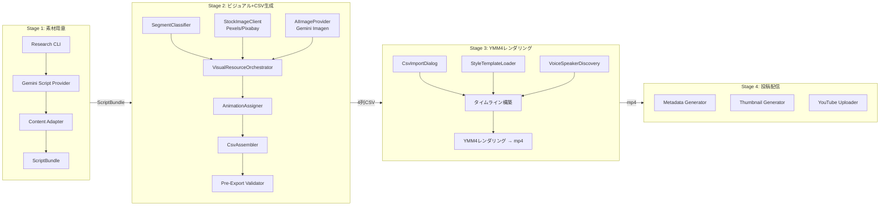
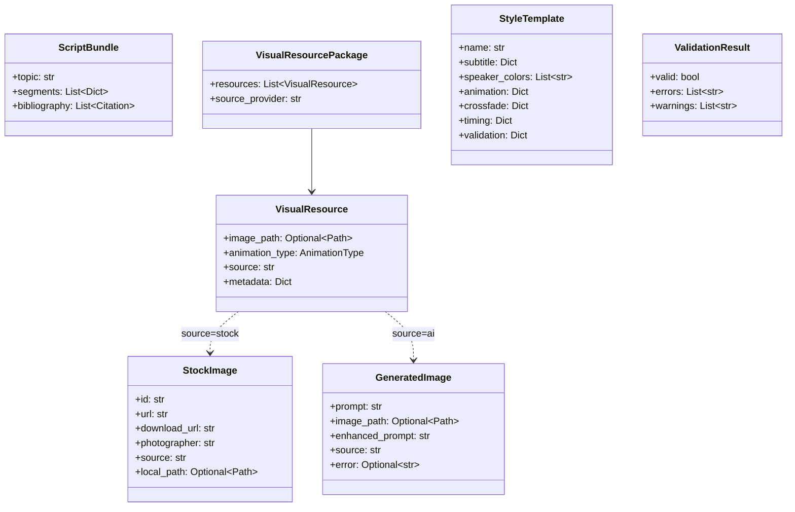
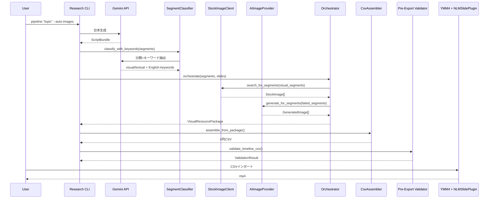

# NLMandSlideVideoGenerator システムアーキテクチャ

最終更新: 2026-03-17

## 概要

NLMandSlideVideoGeneratorは、Web調査から動画投稿までを段階的に自動化するモジュラー型ワークフロー基盤です。Python (CLI/Web UI) で台本生成・ビジュアルリソース取得・CSV生成を行い、YukkuriMovieMaker4 (YMM4) + NLMSlidePlugin で音声合成・タイムライン構築・最終レンダリングを行います。

## システム構成図


```mermaid
flowchart LR
    subgraph S1[Stage 1: 素材用意]
        A1[Research CLI] --> A2[Gemini Script Provider]
        A2 --> A3[Content Adapter]
        A3 --> A4[ScriptBundle]
    end

    subgraph S2[Stage 2: ビジュアル+CSV生成]
        B1[SegmentClassifier]
        B2[StockImageClient<br/>Pexels/Pixabay]
        B3[AIImageProvider<br/>Gemini Imagen]
        B4[VisualResourceOrchestrator]
        B5[AnimationAssigner]
        B6[CsvAssembler]
        B7[Pre-Export Validator]
        B1 --> B4
        B2 --> B4
        B3 --> B4
        B4 --> B5
        B5 --> B6
        B6 --> B7
    end

    subgraph S3[Stage 3: YMM4レンダリング]
        C1[CsvImportDialog]
        C2[StyleTemplateLoader]
        C3[VoiceSpeakerDiscovery]
        C4[タイムライン構築]
        C5[YMM4レンダリング → mp4]
        C1 --> C4
        C2 --> C4
        C3 --> C4
        C4 --> C5
    end

    subgraph S4[Stage 4: 投稿配信]
        D1[Metadata Generator]
        D2[Thumbnail Generator]
        D3[YouTube Uploader]
    end

    S1 -->|ScriptBundle| S2 -->|4列CSV| S3 -->|mp4| S4
```

### Stage 1: 素材用意レイヤー (Python)
- **Research CLI** (`scripts/research_cli.py`): collect→script→align→review→pipeline の一気通貫CLI。`--auto-images` `--duration` オプション対応。
- **Gemini Script Provider**: Gemini API (google-genai SDK) による台本自動生成。`IScriptProvider` インターフェースで差し替え可能。
- **Content Adapter**: NotebookLM固有フォーマット（DeepDive等）を `ScriptBundle` に正規化。
- **音声**: YMM4内蔵ゆっくりボイスを使用。Python側は音声生成を行わない。外部TTS連携コードは2026-03-04に全削除済み。

### Stage 2: ビジュアルリソース+CSV生成レイヤー (Python)
- **SegmentClassifier** (`src/core/visual/segment_classifier.py`): 台本セグメントをvisual/textualに分類。ヒューリスティック + Gemini分類の2モード。
- **StockImageClient** (`src/core/visual/stock_image_client.py`): Pexels/Pixabay APIで写真検索・ダウンロード。日本語→英語クエリ翻訳 (Gemini)、指数バックオフリトライ。
- **AIImageProvider** (`src/core/visual/ai_image_provider.py`): Gemini Imagen 3.0 でカスタムイラスト生成。stock画像取得失敗時のフォールバック。
- **VisualResourceOrchestrator** (`src/core/visual/resource_orchestrator.py`): 全ビジュアルリソースを統合。stock→AI→slideのフォールバック連鎖、連続source多様性強制、アニメーション自動割当。
- **AnimationAssigner** (`src/core/visual/animation_assigner.py`): ken_burns/zoom_in/zoom_out/pan_left/pan_right/pan_up/static の7種を自動サイクル割当。
- **CsvAssembler** (`src/core/csv_assembler.py`): 台本 + VisualResourcePackage → 4列CSV (speaker, text, image_path, animation_type)。
- **Pre-Export Validator** (`src/core/editing/pre_export_validator.py`): CSVバリデーション (画像存在、アニメーション種別、行数チェック)。
- **StyleTemplateManager** (`src/core/style_template.py`): `config/style_template.json` の読み込み・検証・複数テンプレート管理。
- **PipelineState** (`src/core/pipeline_state.py`): パイプラインステップの永続化と再開 (SP-034)。

### Stage 3: YMM4レンダリングレイヤー (C# NLMSlidePlugin)
- **CsvImportDialog**: CSVインポートUI。AudioItem (音声) + TextItem (字幕) + ImageItem (背景画像) を自動配置。
- **StyleTemplateLoader** (`ymm4-plugin/Core/StyleTemplateLoader.cs`): `style_template.json` をPythonと共有読み込み。字幕スタイル/アニメーション設定/クロスフェード/タイミングを統一。
- **VoiceSpeakerDiscovery**: YMM4内蔵ボイスの自動検出・話者割当。
- **WavDurationReader**: WAV実尺読み取り → VoiceItem.VoiceLength でタイムライン同期。
- **ValidateImportItems**: インポート前の品質チェック (連続同一画像検出、統計サマリー)。

### Stage 4: 投稿配信レイヤー (Python)
- **Metadata Generator**: 台本・トピック・引用元から概要欄/タグ/チャプターを生成。
- **Thumbnail Generator**: テンプレートベースのサムネイル自動生成。
- **YouTube Uploader**: YouTube Data API による投稿。手動投稿へのフォールバックも可能。

## ドメインモデル概要


```mermaid
classDiagram
    class ScriptBundle {
        +topic: str
        +segments: List~Dict~
        +bibliography: List~Citation~
    }

    class VisualResourcePackage {
        +resources: List~VisualResource~
        +source_provider: str
    }

    class VisualResource {
        +image_path: Optional~Path~
        +animation_type: AnimationType
        +source: str
        +metadata: Dict
    }

    class StockImage {
        +id: str
        +url: str
        +download_url: str
        +photographer: str
        +source: str
        +local_path: Optional~Path~
    }

    class GeneratedImage {
        +prompt: str
        +image_path: Optional~Path~
        +enhanced_prompt: str
        +source: str
        +error: Optional~str~
    }

    class StyleTemplate {
        +name: str
        +subtitle: Dict
        +speaker_colors: List~str~
        +animation: Dict
        +crossfade: Dict
        +timing: Dict
        +validation: Dict
    }

    class ValidationResult {
        +valid: bool
        +errors: List~str~
        +warnings: List~str~
    }

    VisualResourcePackage --> VisualResource
    VisualResource ..> StockImage : source=stock
    VisualResource ..> GeneratedImage : source=ai
```

## フロー詳細


```mermaid
sequenceDiagram
    participant User
    participant CLI as Research CLI
    participant Gemini as Gemini API
    participant Classifier as SegmentClassifier
    participant Stock as StockImageClient
    participant AI as AIImageProvider
    participant Orch as Orchestrator
    participant Asm as CsvAssembler
    participant Val as Pre-Export Validator
    participant YMM4 as YMM4 + NLMSlidePlugin

    User->>CLI: pipeline "topic" --auto-images
    CLI->>Gemini: 台本生成
    Gemini-->>CLI: ScriptBundle
    CLI->>Classifier: classify_with_keywords(segments)
    Classifier->>Gemini: 分類+キーワード抽出
    Gemini-->>Classifier: visual/textual + English keywords
    CLI->>Orch: orchestrate(segments, slides)
    Orch->>Stock: search_for_segments(visual_segments)
    Stock-->>Orch: StockImage[]
    Orch->>AI: generate_for_segments(failed_segments)
    AI-->>Orch: GeneratedImage[]
    Orch-->>CLI: VisualResourcePackage
    CLI->>Asm: assemble_from_package()
    Asm-->>CLI: 4列CSV
    CLI->>Val: validate_timeline_csv()
    Val-->>CLI: ValidationResult
    User->>YMM4: CSVインポート
    YMM4-->>User: mp4
```

### フォールバック連鎖
1. **ビジュアルリソース**: Pexels → Pixabay → Gemini Imagen → スライド → 空欄
2. **台本生成**: Gemini API → NotebookLMエクスポート → 手動CSV
3. **分類**: Gemini分類 → ヒューリスティック分類
4. **投稿**: YouTube自動投稿 → メタデータのみ生成 → 手動投稿

## アーキテクチャの特徴

### 1. Python/C# 二層構成
- Python: 前工程 (調査→台本→ビジュアル→CSV) + 品質検証
- C# (NLMSlidePlugin): YMM4内でCSV→タイムライン→音声→レンダリング
- 両者は `config/style_template.json` を共有し、スタイル設定を統一

### 2. ビジュアルリソースの多段フォールバック
- SegmentClassifier がセグメントの性質を判定 (visual vs textual)
- visual: StockImageClient (Pexels→Pixabay) → AIImageProvider (Gemini Imagen) → スライド
- textual: スライド (STATIC アニメーション)
- 連続source多様性制御 (MAX_CONSECUTIVE_STOCK=3)

### 3. 統一スタイルテンプレート
- `config/style_template.json` が字幕/アニメーション/クロスフェード/タイミング/話者色を定義
- Python `StyleTemplateManager` と C# `StyleTemplateLoader` の両方が同一JSONを読み込み
- C#側の全ハードコード値をテンプレート参照に置換済み

### 4. CLI一気通貫 + 段階実行
- `research_cli.py pipeline` で collect→script→align→review→CSV一括実行
- 各ステップは独立実行可能 (段階デバッグ)
- PipelineState による途中再開 (SP-034)

### 5. Gemini統合 (4用途)
- 台本生成 (Gemini Flash)
- セグメント分類 + 英語キーワード抽出 (Gemini Flash)
- 日本語→英語クエリ翻訳 (Gemini Flash)
- AI画像生成 (Imagen 3.0)

## 設定と環境

### 環境変数

```bash
GEMINI_API_KEY=...      # 台本生成/分類/翻訳/AI画像生成
PEXELS_API_KEY=...      # ストック画像検索
PIXABAY_API_KEY=...     # ストック画像検索 (フォールバック)
```

### 設定ファイル

| ファイル | 用途 |
|---|---|
| `config/settings.py` | パイプライン設定、APIキー、パス管理 |
| `config/style_template.json` | スタイルテンプレート (Python/C#共有) |
| `config/style_template_cinematic.json` | シネマティックテンプレート (バリアント) |
| `config/style_template_minimal.json` | ミニマルテンプレート (バリアント) |

### 主要ライブラリ

```python
# AI/API
google-genai             # Gemini SDK (台本生成/分類/翻訳/画像生成)
requests                 # Pexels/Pixabay API

# 画像・音声
Pillow                   # サムネイル生成
pydub                    # 音声処理

# Web UI
streamlit                # Web UI

# テスト
pytest                   # 301テストPASS (2026-03-17時点)
```

### テスト

```bash
# 全テスト実行
source venv/Scripts/activate && python -m pytest tests/ -q

# 主要テストモジュール
tests/test_csv_assembler.py          # CsvAssembler
tests/test_segment_classifier.py     # SegmentClassifier
tests/test_stock_image_client.py     # StockImageClient
tests/test_ai_image_provider.py      # AIImageProvider
tests/test_resource_orchestrator.py  # VisualResourceOrchestrator
tests/test_style_template.py         # StyleTemplateManager
tests/test_pre_export_validator.py   # Pre-Export Validator
```
