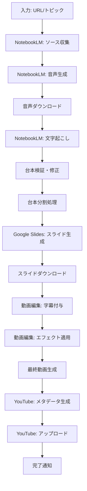

# ワークフロー仕様書

このドキュメントは **「全自動（NotebookLM/Gemini/Slides/YouTube）」の概念フロー** を記述したものです。

- **現行の実運用（SSOT）**: `docs/user_guide_manual_workflow.md`（CSV + 行ごとの WAV を入力として動画生成）
- **現行の開発優先度/未実装一覧**: `docs/backlog.md`

## 1. 全体ワークフロー概要



## 2. 各工程の詳細仕様

### 2.1 Phase 1: NotebookLMでの作業

#### 2.1.1 ソース収集工程
**目的**: 関連情報の自動収集
**入力**: 
- ニュース記事URL（複数可）
- 調査トピック（テキスト）

**処理フロー**:
1. NotebookLMの「検索」機能にURL/トピックを入力
2. 自動的に関連ソース10件を取得
3. ソース品質の評価（信頼性、関連性）
4. 不適切なソースの除外

**出力**: 
- 検証済みソースリスト
- ソース品質スコア

**エラーハンドリング**:
- ソース取得失敗時の再試行（最大3回）
- 品質基準を満たさない場合の警告

#### 2.1.2 音声生成工程
**目的**: ラジオ風解説音声の生成
**入力**: 検証済みソースリスト

**処理フロー**:
1. NotebookLMで「音声」オプションを選択
2. ラジオ風音声解説の生成実行
3. 音声品質の自動評価
4. 音声ファイルの自動ダウンロード

**品質基準**:
- 音声の明瞭度: 95%以上
- 背景ノイズレベル: -40dB以下
- 音声長: 5-30分の範囲内

**出力**: 
- 高品質音声ファイル（WAV/MP3形式）
- 音声メタデータ（長さ、品質スコア等）

#### 2.1.3 文字起こし・台本生成工程
**目的**: 音声から構造化台本の生成
**入力**: 生成済み音声ファイル

**処理フロー**:
1. 音声ファイルをNotebookLMに再アップロード
2. 自動文字起こし実行
3. 台本構造化処理
4. 内容検証・修正

**台本構造**:
```json
{
  "title": "動画タイトル",
  "total_duration": 1800,
  "segments": [
    {
      "id": 1,
      "start_time": 0,
      "end_time": 30,
      "speaker": "ナレーター1",
      "text": "セグメントテキスト",
      "key_points": ["要点1", "要点2"],
      "slide_suggestion": "スライド内容の提案"
    }
  ]
}
```

**検証項目**:
- 文字起こし精度: 98%以上
- 話者識別精度: 95%以上
- タイムスタンプ精度: ±0.5秒以内

### 2.2 Phase 2: Google Slideでの作業

#### 2.2.1 台本分割処理
**目的**: スライド生成に適した台本分割
**入力**: 構造化台本データ

**分割ルール**:
- 1スライドあたり最大200文字
- 論理的な区切りを優先
- 重要なポイントは独立スライド化

**処理フロー**:
1. 台本の意味解析
2. 論理的区切りの特定
3. 文字数制限に基づく分割
4. 要点抽出（長すぎる場合）

#### 2.2.2 スライド生成工程
**目的**: 視覚的に魅力的なスライドの自動生成
**入力**: 分割済み台本セグメント

**処理フロー**:
1. Google Slidesの「スライド作成サポート」を起動
2. 分割された台本をチャット欄に入力
3. スライド生成の実行
4. 生成失敗時の再試行処理

**生成パラメータ**:
- スライドテーマ: ビジネス/教育向け
- フォントサイズ: 最小24pt
- 画像使用: 関連性の高い画像を優先

**品質管理**:
- 文字の可読性チェック
- 画像の適切性評価
- レイアウトの一貫性確認

#### 2.2.3 スライドダウンロード・最適化
**処理フロー**:
1. 完成スライドのPowerPoint形式ダウンロード
2. 画像解像度の最適化（1920x1080）
3. フォント埋め込み処理
4. ファイルサイズの最適化

### 2.3 Phase 3: 動画編集作業

#### 2.3.1 字幕生成・付与工程
**目的**: 日本語字幕の自動生成と配置
**入力**: 音声ファイル、構造化台本

**処理フロー**:
1. 台本からSRTファイル生成
2. 字幕タイミングの調整
3. 字幕スタイルの適用
4. 可読性の最適化

**字幕仕様**:
- フォント: Noto Sans CJK JP
- サイズ: 動画高の5%
- 位置: 下部中央
- 背景: 半透明黒（透明度70%）

#### 2.3.2 リッチエフェクト適用工程
**目的**: スライド画像の動的エフェクト適用
**入力**: スライド画像ファイル群

**エフェクト種類**:
1. **ズームエフェクト**
   - 開始: 100%スケール
   - 終了: 110%スケール
   - 時間: セグメント長に応じて調整

2. **パンエフェクト**
   - 水平移動: ±5%の範囲
   - 垂直移動: ±3%の範囲
   - 移動パターン: ランダム

3. **フェードエフェクト**
   - スライド切り替え時の0.5秒フェード
   - 音声との同期

**処理パラメータ**:
```python
EFFECT_SETTINGS = {
    "zoom": {
        "start_scale": 1.0,
        "end_scale": 1.1,
        "easing": "ease_in_out"
    },
    "pan": {
        "max_horizontal": 0.05,
        "max_vertical": 0.03,
        "duration_factor": 0.8
    },
    "fade": {
        "duration": 0.5,
        "type": "cross_fade"
    }
}
```

#### 2.3.3 動画合成工程
**目的**: 音声、画像、字幕の最終合成
**処理フロー**:
1. 音声トラックの準備
2. 画像シーケンスの生成
3. 字幕トラックの重畳
4. エフェクト適用
5. 最終レンダリング

**出力仕様**:
- 解像度: 1920x1080 (Full HD)
- フレームレート: 30fps
- 音声: AAC 128kbps
- 動画: H.264, CRF 23

### 2.4 Phase 4: YouTube アップロード

#### 2.4.1 メタデータ生成工程
**目的**: YouTube用メタデータの自動生成
**入力**: 台本データ、動画ファイル

**生成内容**:
1. **タイトル生成**
   - 台本から主要トピック抽出
   - SEO最適化されたタイトル
   - 文字数制限: 100文字以内

2. **概要欄生成**
   - 動画の要約
   - タイムスタンプ付き目次
   - 関連リンク
   - ハッシュタグ

3. **タグ生成**
   - 関連キーワード抽出
   - トレンドタグの追加
   - 最大500文字以内

**テンプレート例**:
```
【動画概要】
この動画では、{トピック}について詳しく解説します。

【目次】
00:00 イントロダクション
{タイムスタンプ付き目次}

【関連リンク】
{ソースURL一覧}

#解説動画 #{関連タグ}
```

#### 2.4.2 アップロード工程
**処理フロー**:
1. YouTube API認証
2. 動画ファイルアップロード
3. メタデータ設定
4. サムネイル設定（オプション）
5. 公開設定・スケジュール設定

**API設定**:
```python
YOUTUBE_UPLOAD_SETTINGS = {
    "privacy_status": "private",  # 初期は非公開
    "category_id": "27",  # 教育カテゴリ
    "default_language": "ja",
    "default_audio_language": "ja"
}
```

## 3. エラーハンドリング・リトライ戦略

### 3.1 共通エラーハンドリング
- **ネットワークエラー**: 指数バックオフによる再試行
- **API制限エラー**: 制限解除まで待機
- **ファイル破損**: バックアップからの復旧

### 3.2 工程別エラー対応

#### NotebookLM関連
- ソース取得失敗: 代替ソースの自動検索
- 音声生成失敗: パラメータ調整後再試行
- 文字起こし精度低下: 手動修正モードへ切り替え

#### Google Slides関連
- スライド生成失敗: 台本の再分割
- 文字数制限エラー: 自動要点抽出
- ダウンロード失敗: 形式変更後再試行

#### 動画編集関連
- メモリ不足: 処理の分割実行
- コーデックエラー: 代替コーデックの使用
- 同期ずれ: タイムスタンプの再調整

#### YouTube関連
- アップロード失敗: ファイルサイズ最適化後再試行
- メタデータエラー: 文字数制限の再確認
- 認証エラー: トークン更新

## 4. 品質保証・テスト戦略

### 4.1 自動品質チェック
- 音声品質の定量評価
- 字幕同期精度の検証
- 動画品質の自動評価

### 4.2 人的品質チェックポイント
- 台本内容の事実確認
- スライドデザインの適切性
- 最終動画の総合評価

### 4.3 継続的改善
- ユーザーフィードバックの収集
- 品質指標の継続監視
- アルゴリズムの定期的な改善
